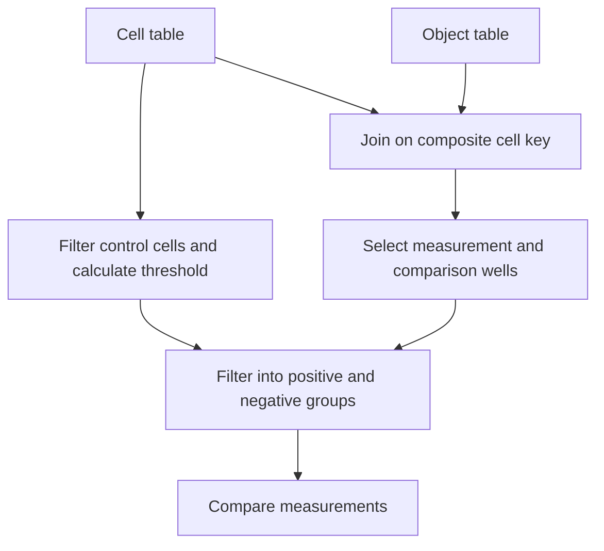

# Relational Data Analysis of Microscopy Measurements

### Joining cell and object tables with pandas for group comparisons and statistical summaries.

## Table of Contents

- [Overview](#overview)
- [Scientific Background](#scientific-background)
- [Data Structure](#data-structure)
- [Computational Workflow](#computational-workflow)
- [Joins and Grouped Analysis](#joins-and-grouped-analysis)
- [Analysis Scripts](#analysis-scripts)
- [Requirements and Usage](#requirements-and-usage)
- [Outputs and Interpretation](#outputs-and-interpretation)

## Overview

This project analyzes tabular measurements exported from automated microscopy. The workflow connects measurements from individual cells with measurements from the objects detected inside them, allowing comparisons at both levels.

I developed these Python scripts for a data analysis consultancy with [Dr. Einat Zalckvar's lab at Bar-Ilan University](https://www.zalckvarlab.com/). The analysis uses **pandas filtering, composite keys, joins, and group comparisons** to organize the exported data, define comparison groups, and examine measurement distributions.

## Scientific Background

Peroxisomes are small compartments inside cells that help break down fatty acids and remove reactive oxygen species. Their number and size vary with cell type and conditions. [Zalckvar Lab research overview](https://www.zalckvarlab.com/research).

Microscopy provides measurements of their number, size, and shape. Linking these measurements to their parent cells allows comparisons between selected cell populations and evaluate experimental treatment outcome.

## Data Structure

The input consists of two tab-separated text files. Each contains a metadata section followed by a `[Data]` marker and the measurement table.

| Table | One row represents | Main contents |
|---|---|---|
| `Objects_Population - Nuclei.txt` | A cell identified through its nucleus | Cell identifiers, marker intensity, and measurements summarized per cell |
| `Objects_Population - 594 Perox.txt` | An individual detected object | Object measurements and the identifier of its parent cell |

A cell is identified by the combination of **`Row`, `Column`, `Field`, and `Object No`**. The object table stores the parent identifier in `594 Perox - Object No in Nuclei`.

Using the full key keeps records from different wells and image fields separate, even when their object numbers are repeated.

## Computational Workflow



The scripts locate `[Data]` before loading each table, select records by well position, and calculate a marker threshold from the **99th percentile of the control population**. This threshold defines positive and negative groups for subsequent comparisons.

Box plots and histograms show the measurement distributions. Two-sided Mann–Whitney U tests compare the selected groups, alongside their means and standard errors.

## Joins and Grouped Analysis

The relational operations are implemented in pandas DataFrames:

| Operation | Purpose | SQL equivalent |
|---|---|---|
| Column selection and Boolean filtering | Select measurements and comparison groups | `SELECT`, `WHERE` |
| Left join on the composite cell key | Add the parent cell's marker intensity to each object | `LEFT JOIN` |
| Summarize filtered groups | Calculate mean measurements for each comparison group | `GROUP BY`, `AVG` |

Group summaries are calculated using `.mean()` on separately filtered DataFrames.

The main object analysis in `Aso_per_perox.py` uses a left join with **`validate="many_to_one"`**. Multiple objects may belong to one cell, while the cell table must have a unique record for each key. This check prevents duplicate cell records from multiplying rows during the join. [pandas merge documentation](https://pandas.pydata.org/docs/reference/api/pandas.DataFrame.merge.html).

Unmatched objects remain in the joined table with missing marker values and are excluded by the later marker comparisons.

## Analysis Scripts

| Script | Role |
|---|---|
| [`Aso_Nati.py`](Aso_Nati.py) | Load the tables, define cell groups, and compare measurements already summarized per cell |
| [`Aso_per_perox.py`](Aso_per_perox.py) | Extend the cell analysis with a validated join and comparisons of individual objects |

## Requirements and Usage

The scripts use Python, pandas, NumPy, SciPy, and Matplotlib. Matplotlib 3.9 or later is needed for the `tick_labels` argument used in the box plots. [Matplotlib documentation](https://matplotlib.org/stable/api/_as_gen/matplotlib.pyplot.boxplot.html).

```bash
python -m pip install pandas numpy scipy "matplotlib>=3.9"
```

1. Open `Aso_Nati.py` for cell comparisons or `Aso_per_perox.py` for the extended workflow.
2. Update `file_path_Nuclei` and `file_path_perox` to point to the two exports.
3. Review the row and column filters to match the plate layout and intended control group.
4. Check the measurement selected by `test_col`. Selection uses column positions, so the export's column order matters.
5. Run the analysis blocks in order and inspect the tables and plots.

In the object analysis, `df_negative_perox` is assigned twice. Running both assignments uses the second definition, which selects objects from separate control wells. Keep the assignment matching the intended comparison.

The measurement exports are not included. Running the scripts requires files with the expected headers and columns.

## Outputs and Interpretation

The scripts create filtered and joined DataFrames in memory, display plots, and print p-values and mean ± SEM summaries. They do not automatically save a report or export result tables.

The final restricted-range histogram in `Aso_per_perox.py` displays the p-value from the earlier, unfiltered comparison; it does not recalculate the test for the displayed subset.
